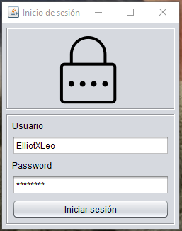
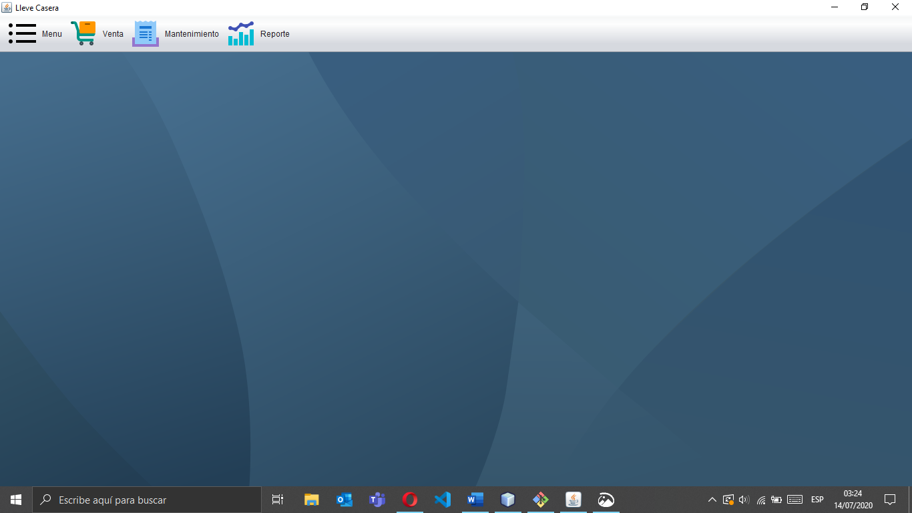
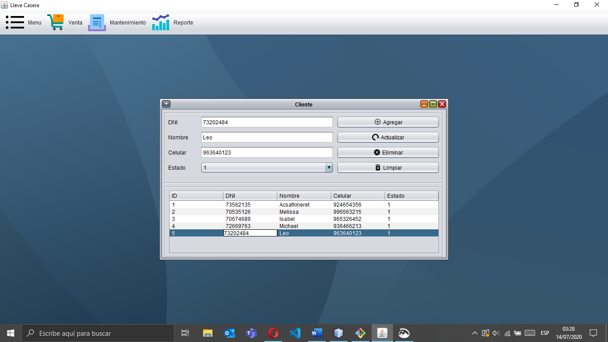
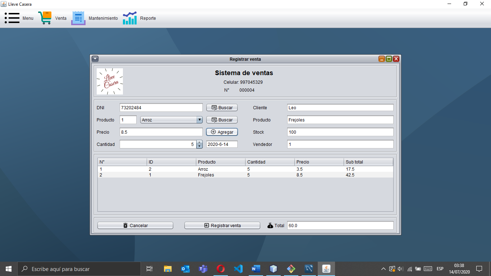
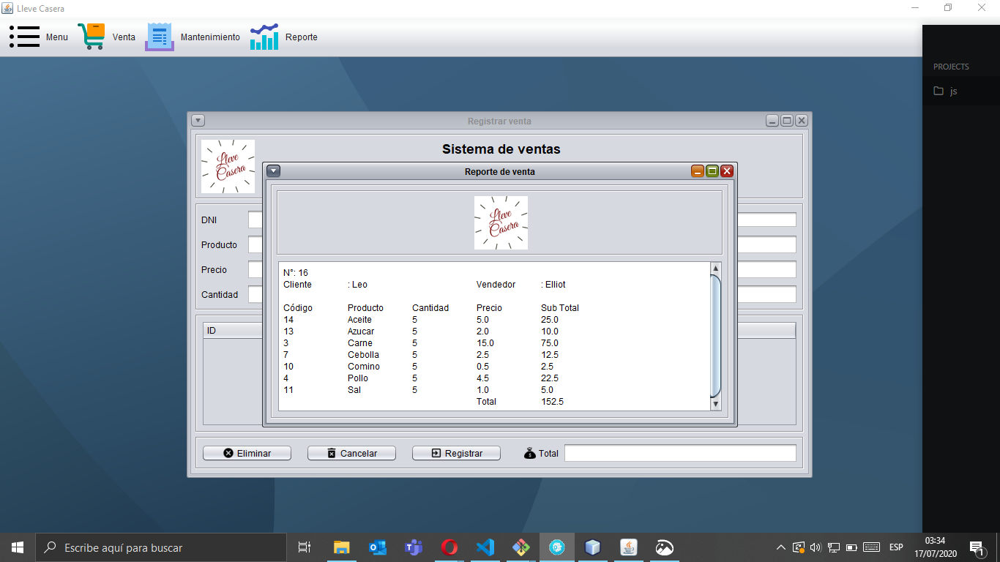

# LleveCasera
Sistema de Ventas. Java 8 y MySQL 8

## Instalación rápida (2020-09-1)
### Requisitos
1.	MySQL 8.X
    - https://dev.mysql.com/downloads/windows/installer/8.0.html
2.	Java 8.X 
    -	https://www.oracle.com/in/java/technologies/javase/javase-jdk8-downloads.html

3.	NetBeans 8.X
    - https://netbeans.org/downloads/8.2/rc/

### Procedimiento
1.	Clonar repositorio o descargar zip
    - git clone https://github.com/ElliotXLeo/LleveCasera.git

2.	Cargar base de datos
    - \LleveCasera\BaseDeDatos
      - Opciones:
        - Ejecutar script LleveCaseraBD
        - ModeloEntidadRelacion
          -	Abrir lleve_casera
          - Ctrl + G

3.	Cargar datos del proyecto
    - \LleveCasera\BaseDeDatos\LleveCaseraBD_Datos.sql

4.	Abrir Proyecto LleveCasera con NetBeans
    - \LleveCasera\LleveCasera

5.	Resolver problemas del proyecto
    - \LleveCasera\BaseDeDatos\mysql-connector-java-1.49.zip
      - Descomprimir
      - Agregar .jar
        - \LleveCasera\BaseDeDatos\mysql-connector-java-5.1.49\mysql-connector-java-5.1.49-bin.jar

6.	Modificar user y pass si es necesario de la clase Conexión.java
    - \LleveCasera\LleveCasera\src\modelo\Conexion.java

7.	Compilar Proyecto
    - Disfrute y comparte.

## Capturas de LleveCasera

### Inicio de sesión

### Pantalla principal

### Mantenimiento cliente

### Registro venta

### Reporte venta

